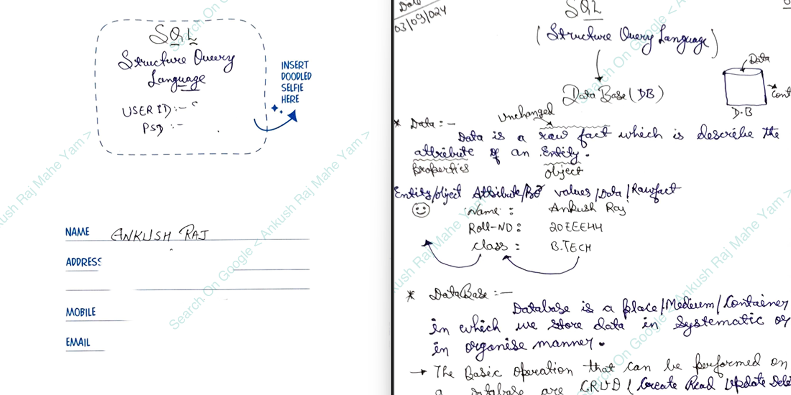

# SQL Assignments: From Ankush Raj’s Handwritten SQL Notes  

This repository contains a collection of **SQL assignments** derived from my(Ankush Raj) **handwritten SQL notes** created during training at the **Q-Spider Software Training Institute**. These assignments are designed to help learners practice and apply SQL concepts with real-world examples and queries.  

---

## Repository Structure  

The assignments are organized into folders, each focusing on specific SQL topics and concepts. Future assignments will follow the same structure and will be added incrementally.  

### Folder Structure  

```
SQL-Assignment_Q-Spider/  
    ├── Assign1/  
    │   └── Assign1.sql  
    ├── Assign2/  
    │   └── Assign2.sql  
    ├── Assign3/  
    │   └── Assign3.sql  
    └── (Future Assignments will be added in separate folders)  
```  

### Example Assignments  

#### Folder: Assign1  

The **Assign1** folder includes assignments focused on **SQL Basics**:  
- Writing queries using `SELECT`and `FROM`clauses.

#### Folder: Assign2  

The **Assign2** folder explores **Selection**:  
- Writing queries using `SELECT`, `FROM` and `WHERE`clauses.

#### Folder: Assign3  

The **Assign3** folder focuses on **OPERATORS**:  
1. Arithmetic Operators (+,-,*,.....)  
2. Comparison(=, !=)
3. Relational(<,>,=<,=>)
.
.
.
.


---

## Topics Covered in Assignments  

1️⃣ **Introduction to Databases**  
   - Database concepts and RDBMS basics.  

2️⃣ **SQL Commands**  
   - DDL, DML, TCL, DCL, and DQL Commands.  

3️⃣ **SQL Operators**  
   - Arithmetic, Comparison, Logical, and more.  

4️⃣ **SQL Functions**  
   - **Aggregate Functions** (`MAX`, `MIN`, `SUM`, `AVG`, `COUNT`).  
   - **Single-Row Functions**: String, Date, and Number manipulation functions.  
   - **Multi-Row Functions**: Analysis using `GROUP BY` and `HAVING`.  

5️⃣ **Subqueries**  
   - Nested Queries, Single-row, and Multi-row Subqueries.  

6️⃣ **Joins**  
   - Inner, Outer, Self, and Cartesian Joins.  

7️⃣ **Normalization**  
   - First Normal Form (1NF) to Fifth Normal Form (5NF).  


---

## How to Use  

1. Clone the repository:  
   ```bash  
   git clone https://github.com/AnkushRajMaheYam/SQL-Assignment_Q-Spider.git  
   ```  

2. Navigate to the desired assignment folder:  
   ```bash  
   cd SQL-Assignment_Q-Spider/Assign1  
   ```  

3. Execute the `.sql` file in your preferred database environment (e.g., MySQL, Oracle, or SQL Server).  

---

## LinkedIn Post  

Check out the full handwritten notes that inspired these assignments:  

👉 [SQL Handwritten Notes by Ankush Raj Mahe Yam](https://www.linkedin.com/posts/ankushrajmaheyam_sql-handwritten-full-notes-ankush-raj-mahe-activity-7261754552075333633-6vMt?utm_source=share&utm_medium=member_desktop)  


---

## About Me  

Hi, I’m **Ankush Raj or Ankush Raj Mahe Yam (ARMY)**, an aspiring software developer currently pursuing Java Full Stack Development. I’m passionate about coding and enjoy sharing my learning journey to help others grow.  

🌟 Connect with me:  
- **Google Search:** [Ankush Raj Mahe Yam](https://www.google.com/search?q=ankush+raj+mahe+yam)  
- **LinkedIn:** [Ankush Raj Mahe Yam](https://linkedin.com/in/ankushrajmaheyam)  
- **GitHub:** [Ankush Raj Mahe Yam](https://github.com/AnkushRajMaheYam)  
- **Instagram:** [@AnkushRajaMaheYam](https://instagram.com/AnkushRajaMaheYam)  
- **Facebook:** [Ankush Raj Mahe Yam](https://facebook.com/AnkushRajMaheYam)  

---

## Disclaimer  

These assignments are based on my handwritten notes and may contain minor errors or typos. They are intended **purely for educational purposes**.  

---

**License:**  
This repository is licensed under the MIT License.  

---  

## **Acknowledgements**
Special thanks to the mentor(**Akash Sir**) and faculty at **J-Spider Software Training Institute (Noida Branch)** for providing excellent guidance and support throughout the course.

Feel free to explore, practice, and enhance your SQL skills! 😊  
Happy practicing SQL! 🎉  
